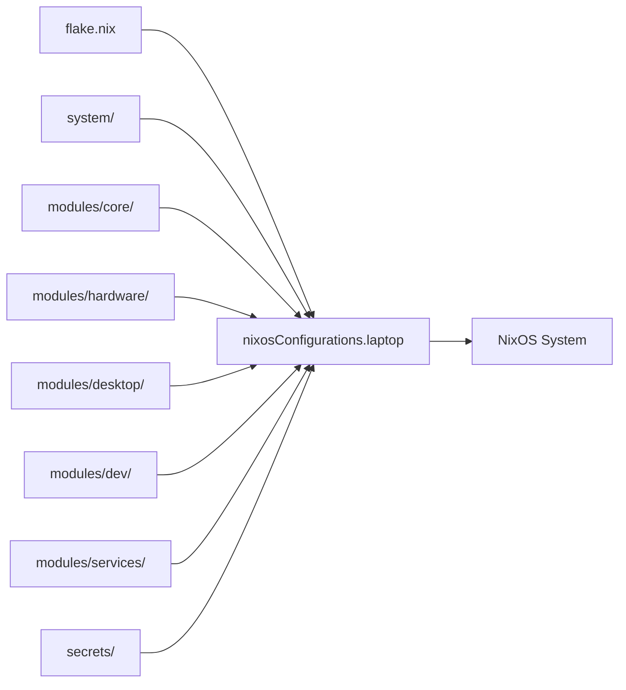

<div align="center">

# HX NixOS

**Declarative [NixOS](https://nixos.org/) configuration for my laptop.**

[](https://nixos.org/)
[](LICENSE)

</div>

A single-host [Nix Flake](https://wiki.nixos.org/wiki/Flakes) defining the complete laptop system: storage, hardware, desktop, development environment, services, secrets, and recovery.

---

## Contents

* [System Composition](#system-composition)
* [System](#system)
* [Repository](#repository)
* [Operations](#operations)
* [Secrets](#secrets)
* [Recovery](#recovery)
* [License](#license)

## System Composition



## System

| Layer            | Technology                                                | Role                             |
| ---------------- | --------------------------------------------------------- | -------------------------------- |
| Operating System | [NixOS](https://nixos.org/)                               | Declarative system configuration |
| Storage          | [Disko](https://github.com/nix-community/disko) + LUKS    | Disk layout and encryption       |
| Secure Boot      | [Lanzaboote](https://github.com/nix-community/lanzaboote) | Secure Boot management           |
| Desktop          | [Sway](https://swaywm.org/)                               | Wayland desktop                  |
| Applications     | [Flatpak](https://flatpak.org/) + Nix                     | Desktop and system packages      |
| Secrets          | [SOPS-Nix](https://github.com/Mic92/sops-nix)             | Encrypted runtime secrets        |
| Network          | [WireGuard](https://www.wireguard.com/)                   | VPN connectivity                 |
| Backup           | [Restic](https://restic.net/)                             | Encrypted backups                |
| Development      | Nix + containers                                          | Development environment          |

## Repository

```text
.
├── system/             # Disk and hardware configuration
├── modules/
│   ├── core/           # Boot, Nix, network, users, secrets
│   ├── desktop/        # Sway, applications, audio, fonts
│   ├── dev/            # Packages, shell, containers, YubiKey
│   ├── hardware/       # Kernel, graphics, power, virtualisation
│   └── services/       # Backups, VPN, and system services
├── secrets/            # SOPS-encrypted secrets
├── flake.nix           # System composition
├── flake.lock          # Pinned dependencies
├── install.sh          # Installation workflow
└── AGENTS.md           # Repository and agent context
```

[`flake.nix`](flake.nix) is the source of truth for enabled modules. A module is active only when explicitly included in `nixosConfigurations.laptop`.

## Operations

Format the configuration:

```bash
nix fmt
```

Validate the flake:

```bash
nix flake check
```

Build without modifying the running system:

```bash
nixos-rebuild build --flake .#laptop
```

Apply the configuration:

```bash
sudo nixos-rebuild switch --flake .#laptop
```

Install or rebuild the machine through [nixos-anywhere](https://github.com/nix-community/nixos-anywhere):

```bash
./install.sh
```

## Secrets

Secrets are encrypted with [SOPS](https://github.com/getsops/sops) and stored in [`secrets/laptop.yaml`](secrets/laptop.yaml).

[SOPS-Nix](https://github.com/Mic92/sops-nix) decrypts secrets at activation time using the host SSH identity. Plaintext secrets are not stored in Git.

## Recovery

* The complete NixOS configuration is reproducible from Git and `flake.lock`.
* Disk layout and encryption are declared with Disko.
* `install.sh` provides the machine installation path through nixos-anywhere.
* SOPS restores encrypted runtime configuration.
* Restic protects persistent user and security-critical data.

## License

Distributed under the [MIT License](LICENSE).

